# Execution Plan

**프로젝트**: 테이블오더 서비스
**작성일**: 2026-02-09
**프로젝트 타입**: Greenfield

---

## Detailed Analysis Summary

### Change Impact Assessment
- **User-facing changes**: Yes - 고객용 주문 인터페이스, 관리자용 대시보드
- **Structural changes**: Yes - 신규 시스템 전체 아키텍처 설계 필요
- **Data model changes**: Yes - 8개 엔티티 (Store, Table, TableSession, Category, Menu, Order, OrderItem, OrderHistory)
- **API changes**: Yes - 고객용 4개, 관리자용 11개 API 엔드포인트
- **NFR impact**: Yes - 실시간 SSE, 100ms 응답 시간, 50-200 동시 사용자

### Risk Assessment
- **Risk Level**: Medium
- **Rollback Complexity**: Easy (Greenfield - 롤백 불필요)
- **Testing Complexity**: Moderate (실시간 기능, 다중 사용자 타입)

---

## Workflow Visualization

### Mermaid Diagram

```mermaid
flowchart TD
    Start(["User Request"])
    
    subgraph INCEPTION["INCEPTION PHASE"]
        WD["Workspace Detection<br/>COMPLETED"]
        RA["Requirements Analysis<br/>COMPLETED"]
        US["User Stories<br/>COMPLETED"]
        WP["Workflow Planning<br/>IN PROGRESS"]
        AD["Application Design<br/>EXECUTE"]
        UG["Units Generation<br/>EXECUTE"]
    end
    
    subgraph CONSTRUCTION["CONSTRUCTION PHASE"]
        FD["Functional Design<br/>EXECUTE"]
        NFRA["NFR Requirements<br/>EXECUTE"]
        NFRD["NFR Design<br/>EXECUTE"]
        ID["Infrastructure Design<br/>EXECUTE"]
        CG["Code Generation<br/>EXECUTE"]
        BT["Build and Test<br/>EXECUTE"]
    end
    
    subgraph OPERATIONS["OPERATIONS PHASE"]
        OPS["Operations<br/>PLACEHOLDER"]
    end
    
    Start --> WD
    WD --> RA
    RA --> US
    US --> WP
    WP --> AD
    AD --> UG
    UG --> FD
    FD --> NFRA
    NFRA --> NFRD
    NFRD --> ID
    ID --> CG
    CG --> BT
    BT --> OPS
    OPS --> End(["Complete"])

    style WD fill:#4CAF50,stroke:#1B5E20,stroke-width:3px,color:#fff
    style RA fill:#4CAF50,stroke:#1B5E20,stroke-width:3px,color:#fff
    style US fill:#4CAF50,stroke:#1B5E20,stroke-width:3px,color:#fff
    style WP fill:#4CAF50,stroke:#1B5E20,stroke-width:3px,color:#fff
    style AD fill:#FFA726,stroke:#E65100,stroke-width:3px,color:#000
    style UG fill:#FFA726,stroke:#E65100,stroke-width:3px,color:#000
    style FD fill:#FFA726,stroke:#E65100,stroke-width:3px,color:#000
    style NFRA fill:#FFA726,stroke:#E65100,stroke-width:3px,color:#000
    style NFRD fill:#FFA726,stroke:#E65100,stroke-width:3px,color:#000
    style ID fill:#FFA726,stroke:#E65100,stroke-width:3px,color:#000
    style CG fill:#4CAF50,stroke:#1B5E20,stroke-width:3px,color:#fff
    style BT fill:#4CAF50,stroke:#1B5E20,stroke-width:3px,color:#fff
    style OPS fill:#BDBDBD,stroke:#424242,stroke-width:2px,color:#000
    style Start fill:#CE93D8,stroke:#6A1B9A,stroke-width:3px,color:#000
    style End fill:#CE93D8,stroke:#6A1B9A,stroke-width:3px,color:#000
```



### Text Alternative

```
INCEPTION PHASE:
  [x] Workspace Detection (COMPLETED)
  [x] Requirements Analysis (COMPLETED)
  [x] User Stories (COMPLETED)
  [x] Workflow Planning (IN PROGRESS)
  [ ] Application Design (EXECUTE)
  [ ] Units Generation (EXECUTE)

CONSTRUCTION PHASE:
  [ ] Functional Design (EXECUTE)
  [ ] NFR Requirements (EXECUTE)
  [ ] NFR Design (EXECUTE)
  [ ] Infrastructure Design (EXECUTE)
  [ ] Code Generation (EXECUTE)
  [ ] Build and Test (EXECUTE)

OPERATIONS PHASE:
  [ ] Operations (PLACEHOLDER)
```

---

## Phases to Execute

### INCEPTION PHASE
- [x] Workspace Detection (COMPLETED)
- [x] Reverse Engineering (SKIPPED - Greenfield)
- [x] Requirements Analysis (COMPLETED)
- [x] User Stories (COMPLETED)
- [x] Workflow Planning (IN PROGRESS)
- [ ] Application Design - **EXECUTE**
  - **Rationale**: 신규 시스템으로 컴포넌트 설계, 서비스 레이어 정의, 비즈니스 규칙 명세 필요
- [ ] Units Generation - **EXECUTE**
  - **Rationale**: Backend/Frontend(Customer/Admin) 3개 유닛으로 분해 필요

### CONSTRUCTION PHASE
- [ ] Functional Design - **EXECUTE**
  - **Rationale**: 8개 데이터 모델, 복잡한 비즈니스 로직 (세션 관리, 주문 상태 전이)
- [ ] NFR Requirements - **EXECUTE**
  - **Rationale**: 실시간 SSE, 100ms 응답 시간, 보안 요구사항 존재
- [ ] NFR Design - **EXECUTE**
  - **Rationale**: NFR 패턴 적용 필요 (캐싱, 연결 관리, 인증)
- [ ] Infrastructure Design - **EXECUTE**
  - **Rationale**: AWS EC2, RDS, S3 인프라 설계 필요
- [ ] Code Generation - **EXECUTE** (ALWAYS)
  - **Rationale**: 구현 필수
- [ ] Build and Test - **EXECUTE** (ALWAYS)
  - **Rationale**: 빌드 및 테스트 필수

### OPERATIONS PHASE
- [ ] Operations - **PLACEHOLDER**
  - **Rationale**: 향후 배포/모니터링 워크플로우

---

## Execution Summary

| Phase | Stage | Status | Rationale |
|-------|-------|--------|-----------|
| INCEPTION | Workspace Detection | COMPLETED | - |
| INCEPTION | Reverse Engineering | SKIPPED | Greenfield |
| INCEPTION | Requirements Analysis | COMPLETED | - |
| INCEPTION | User Stories | COMPLETED | - |
| INCEPTION | Workflow Planning | IN PROGRESS | - |
| INCEPTION | Application Design | EXECUTE | 컴포넌트/서비스 설계 필요 |
| INCEPTION | Units Generation | EXECUTE | 3개 유닛 분해 |
| CONSTRUCTION | Functional Design | EXECUTE | 데이터 모델, 비즈니스 로직 |
| CONSTRUCTION | NFR Requirements | EXECUTE | 성능, 보안 요구사항 |
| CONSTRUCTION | NFR Design | EXECUTE | NFR 패턴 적용 |
| CONSTRUCTION | Infrastructure Design | EXECUTE | AWS 인프라 설계 |
| CONSTRUCTION | Code Generation | EXECUTE | 구현 필수 |
| CONSTRUCTION | Build and Test | EXECUTE | 빌드/테스트 필수 |
| OPERATIONS | Operations | PLACEHOLDER | 향후 확장 |

---

## Units Overview (예상)

| Unit | Description | Tech Stack |
|------|-------------|------------|
| backend | FastAPI 백엔드 서버 | Python, FastAPI, SQLAlchemy, MySQL |
| frontend-customer | 고객용 태블릿 앱 | Vue.js |
| frontend-admin | 관리자용 대시보드 | Vue.js |

---

## Success Criteria

- **Primary Goal**: 테이블오더 서비스 MVP 구현
- **Key Deliverables**:
  - 고객용 주문 인터페이스
  - 관리자용 실시간 대시보드
  - 메뉴 관리 기능
  - 테이블 세션 관리
- **Quality Gates**:
  - 40개 User Stories 구현
  - API 응답 시간 100ms 이하 (목표)
  - 테스트 커버리지 80% 이상 (핵심 로직)
